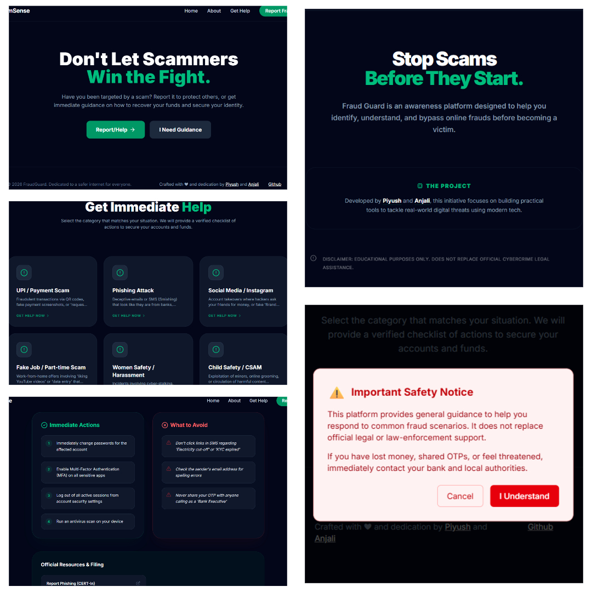

# ScamSense 🛡️

**ScamSense** is a modern awareness platform designed to help users identify and bypass digital frauds through interactive guidance and realistic scam examples. It empowers potential victims with immediate recovery steps and direct access to official government reporting channels.

## 👥 Collaborative Project

This project was co-developed with:

- **Piyush** ([@piyushbrl69](https://github.com/piyushbrl69))
- **Anjali Pandey** ([@anjali-pandey-28](https://github.com/anjali-pandey-28))

## 🚀 Key Features

- **Interactive Scam Selector**: Categorized guidance for UPI, Phishing, Social Media, and Job frauds.
- **Emergency Recovery Checklists**: Step-by-step instructions on what to do immediately after a scam occurs.
- **Official Resource Hub**: Verified links to National Cyber Crime Portal, NCW, and Childline India.
- **Responsive Glassmorphism UI**: High-trust design built for both desktop and mobile safety.

## 🛠️ Tech Stack

- **Framework**: Next.js 14 (App Router)
- **Language**: TypeScript
- **Styling**: Tailwind CSS
- **Icons**: Lucide-react

## Live Link

- **ScamSense** ([Live Link](https://scam-sense-web.vercel.app/))

## 🖼️ Preview

